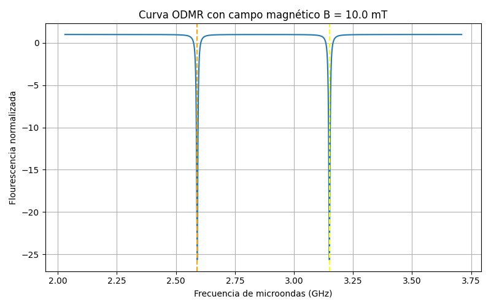

# 🔬 Quantum Sensing

Educational notes and Python simulations on nitrogen-vacancy (NV) centers in diamond.

## Overview

This repository contains my study notes, technical documentation and learning material related to quantum sensing with nitrogen-vacancy (NV) centers in diamond.

The project was developed during my summer research internship at the Nanomaterials and Nanotechnology Research Center (CINN), where I am studying the fundamentals of quantum sensing, microwave instrumentation and ODMR (Optically Detected Magnetic Resonance).

Besides theoretical material, the repository includes an interactiva Python program tha simulates ODMR spectra under different experimental conditions and reconstructs the external magnetic field from the resonance frequencies.

---

## Topics

- Quantum sensing
- ODMR
- NV Centers
- Python
- Simulation
- Physics
- Diamond
- Quantum Physics

---

## Repository Contents

- 📃 Literature review
- 📃 Study notes
- 📃 Technical summaries
- 📊 Figures and diagrams
- 🐍 Interactive ODMR simulator (Python)
- 📑 Automatically generated simulation reports

---

## 🖥️ ODMR Simulator

The repository includes an interactive Python simulator that reproduces the ODMR spectrum of a single NV center in diamond under different experimental conditions.

The simulator allows the user to modify the main experimental parameters, visualize the resulting ODMR spectra and estimate the external magnetic field from the measured resonance frequencies.

---

### Features

 - ✅ ODMR Simulation without magnetic field
 - ✅ ODMR Simulation with external magnetic field
 - ✅ Zeeman splitting simulation
 - ✅ Adjustable microwave power
 - ✅ Adjustable photon detection rate
 - ✅ Adjustable experimental noise
 - ✅ Automatic resonance detection
 - ✅ Magnetic field estimation
 - ✅ Relative sensitivity calculation
 - ✅ Comparison of multiple magnetic fields
 - ✅ Automatic PNG figure generation
 - ✅ Automatic TXT report generation

---

### Example

---

## Research Progress

This repository is actively updated throughout my research intership as I continue learning and documenting new concepts and techniques.
