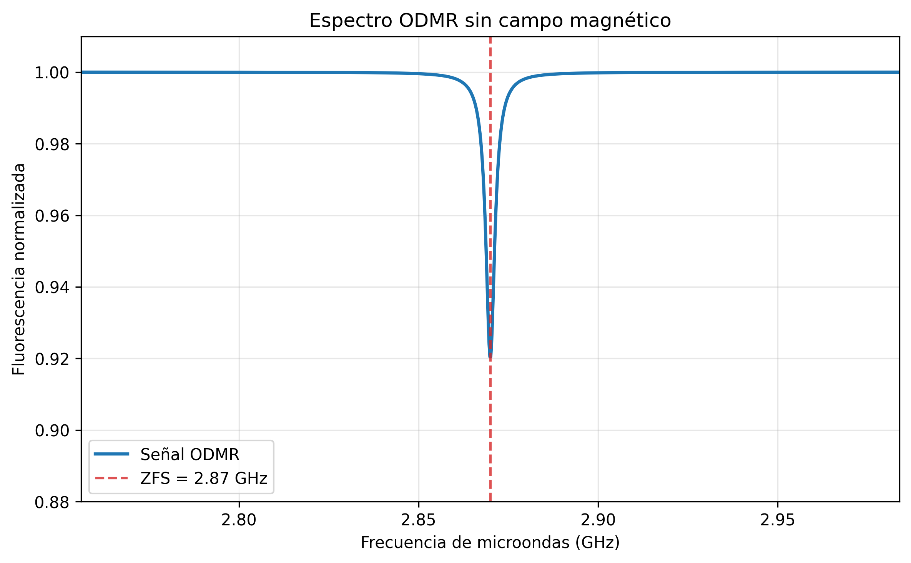
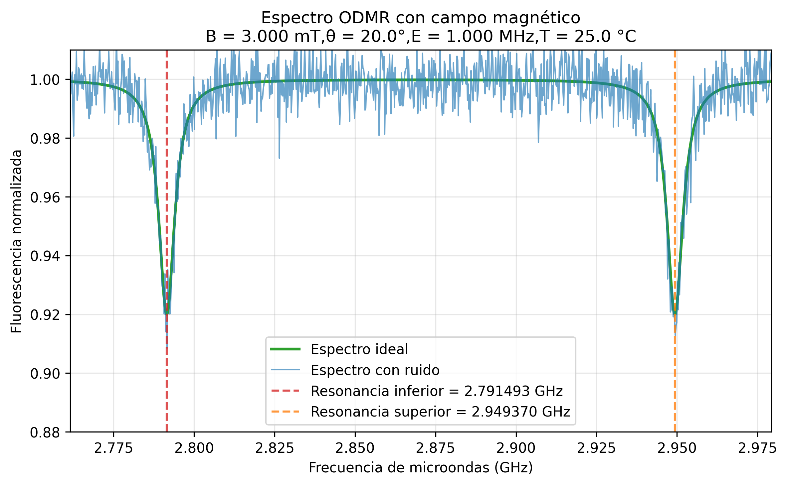
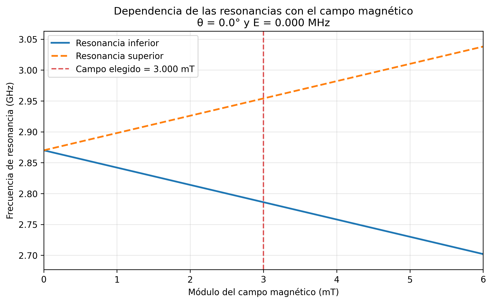
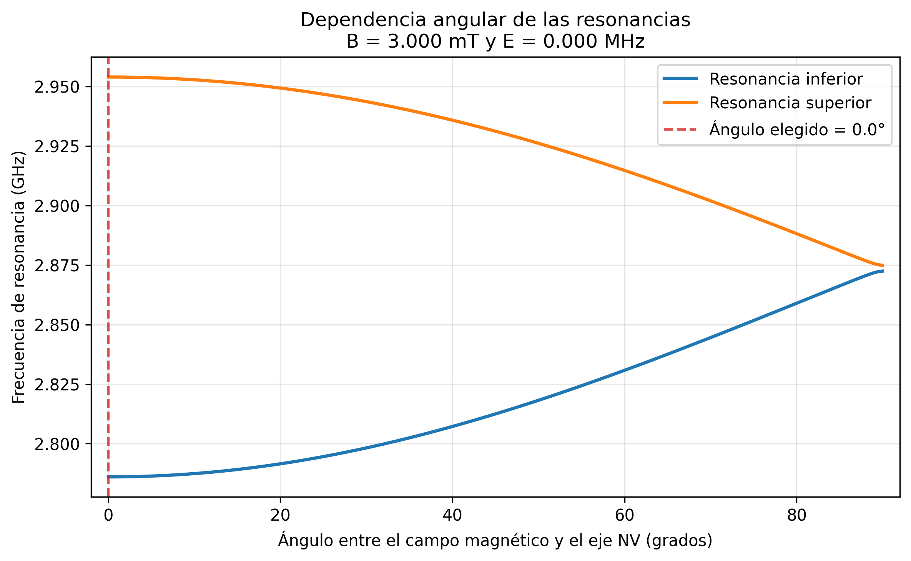
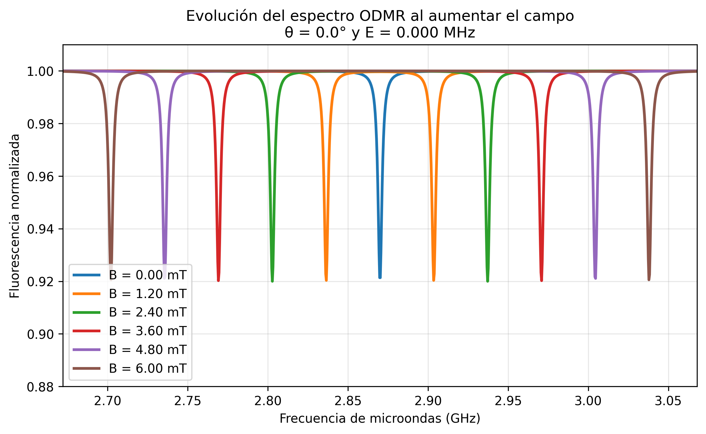
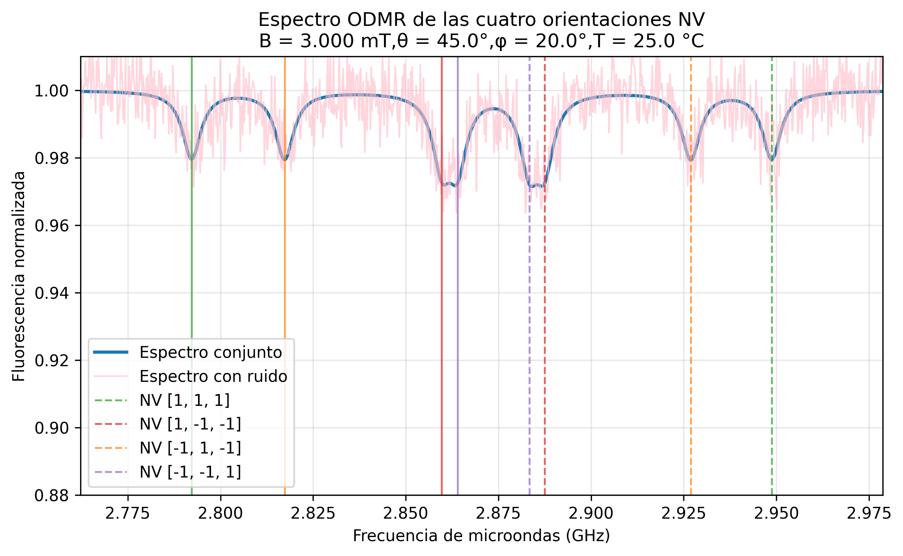
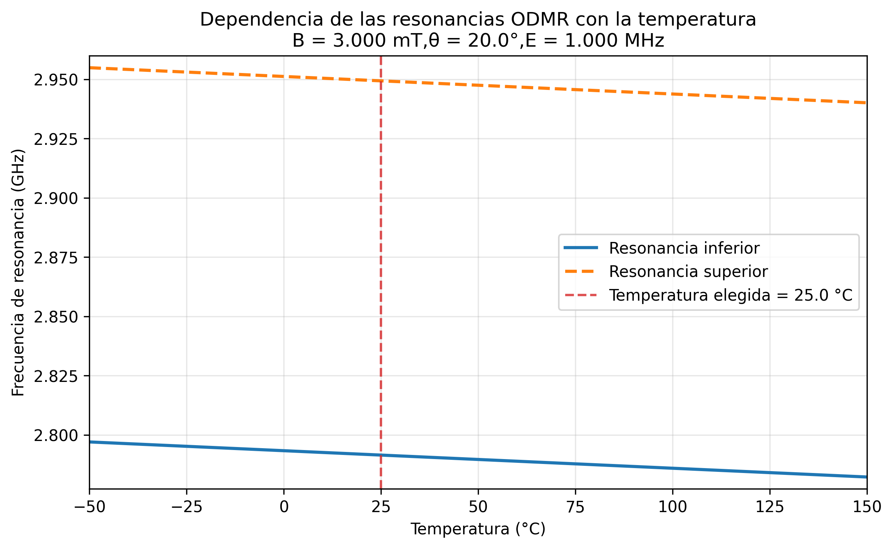
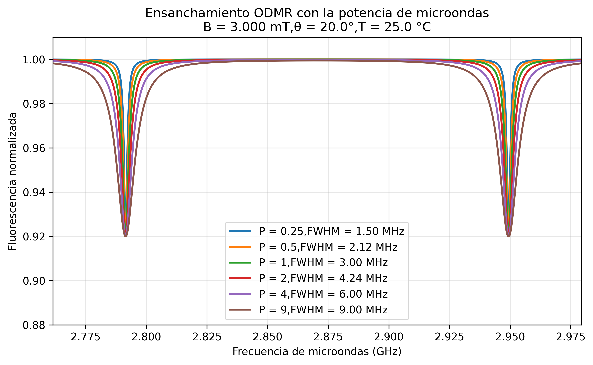
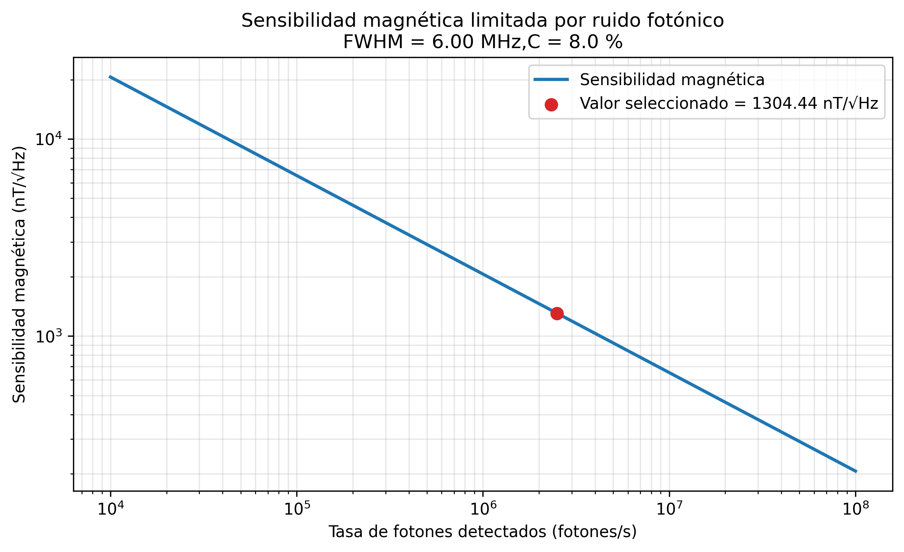
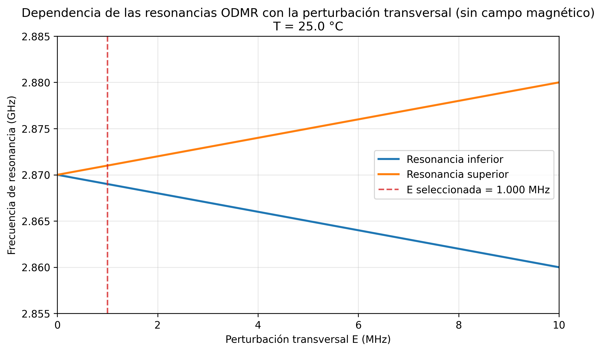

# 🔬 Quantum Sensing with NV Centers in Diamond

Educational material and Python simulations on quantum sensing based on nitrogen-vacancy (NV) centers in diamond.


---

## 🌟 Overview

This repository was developed during my extracurricular internship at the **Nanomaterials and Nanotechnology Research Center (CINN), Spain**.

It combines a comprehensive introductory study manual with an interactive Python simulator focused on **quantum sensing with nitrogen-vacancy (NV) centers in diamond**.

The repository connects theoretical foundations with numerical simulation, allowing users to study the physical principles of NV centers and visualize how different experimental parameters modify Optically Detected Magnetic Resonance (ODMR) spectra.

The project was designed as an educational resource for students beginning in quantum sensing, condensed-matter physics, quantum technologies or experimental instrumentation.

---

## ✨ Main Features

- ✅ Complete 75-page introductory study manual
- ✅ Original educational figures and technical diagrams
- ✅ Complete scientific bibliography and figure attribution
- ✅ Interactive Python ODMR simulator
- ✅ Effective spin-1 Hamiltonian implementation
- ✅ Numerical Hamiltonian diagonalization
- ✅ Zero-field splitting
- ✅ Zeeman interaction
- ✅ Arbitrary magnetic-field orientation
- ✅ Four crystallographic NV orientations
- ✅ Transverse perturbation caused by strain or electric fields
- ✅ Temperature dependence of the zero-field splitting
- ✅ Lorentzian ODMR spectra
- ✅ Microwave-power broadening
- ✅ Photon shot-noise simulation
- ✅ Technical-noise simulation
- ✅ Longitudinal magnetic-field estimation from resonance splitting
- ✅ Magnetic-sensitivity estimation
- ✅ Automatic generation of ten scientific figures
- ✅ Automatic generation of a structured TXT simulation report
- ✅ Reproducible simulations using a fixed random seed

---

# 📖 Quantum Sensing Study Manual

The repository includes a complete **75-page study manual** introducing the physical principles of quantum sensing based on nitrogen-vacancy centers in diamond.

The manual was written during my internship at CINN as educational material for students beginning in this research field.

## Topics Covered

- Fundamentals of quantum sensing
- Physical quantities measured by quantum sensors
- Advantages and limitations of quantum sensors
- Diamond as a quantum material
- Nitrogen-vacancy centers
- NV charge states
- NV crystallographic orientations
- Spin states of the NV center
- Effective spin Hamiltonian
- Spin-1 matrix representation
- Zero-field splitting
- Zeeman interaction
- Electric-field and strain effects
- Ground- and excited-state level anticrossings
- Spin relaxation and coherence
- Optically Detected Magnetic Resonance
- ODMR spectrum interpretation
- Magnetic sensitivity
- Noise and signal-to-noise ratio
- Microwave spin control
- Microwave antennas and transmission structures
- Radiofrequency signal generators
- Spectrum analyzers
- Experimental instrumentation

The manual also contains:

- Original educational figures
- Technical diagrams
- Commented equations
- Figures adapted from scientific literature
- Complete bibliography
- Figure attribution and treatment table
- Author notes and methodological explanations

📄 **Study Manual**

[`Quantum_Sensing_Study_Manual.pdf`](docs/Quantum_Sensing_Study_Manual.pdf)

---

# 🐍 ODMR Python Simulator

The repository includes an interactive Python simulator that reproduces ODMR spectra of nitrogen-vacancy centers in diamond.

The simulator numerically constructs and diagonalizes the effective spin Hamiltonian, calculates resonance frequencies under different experimental conditions and generates ideal and noisy ODMR spectra.

It also analyzes the effect of magnetic field, orientation, temperature, transverse perturbations, microwave power and photon detection rate.

## Simulator Capabilities

- Interactive user input
- Automatic use of default values
- Single-axis NV model
- Four crystallographic NV orientations
- Zero-field ODMR simulation
- ODMR under an external magnetic field
- Magnetic-field vector decomposition
- Magnetic-field projection onto each NV orientation
- Resonance-frequency calculation
- Longitudinal magnetic-field estimation from Zeeman splitting
- Temperature-dependent zero-field splitting
- Transverse perturbation simulation
- Microwave-power broadening
- Photon shot-noise simulation
- Technical Gaussian noise
- Magnetic-sensitivity estimation
- Minimum detectable magnetic-field estimation
- Automatic PNG export
- Automatic TXT report generation

---

# ⚛️ Physics Implemented

The simulator includes the following physical model:

- Effective ground-state Hamiltonian for an NV center
- Electronic spin $S = 1$
- Zero-field splitting $D \approx 2.87\ \mathrm{GHz}$
- Zeeman interaction
- Electron gyromagnetic ratio
- Arbitrary magnetic-field orientation
- Transverse perturbation parameter $E$
- Numerical Hamiltonian diagonalization
- Transition-frequency calculation
- Four crystallographic directions of the NV center
- Lorentzian ODMR line shapes
- Temperature dependence of $D$
- Microwave-power broadening

The effective Hamiltonian used in the simulation is

```math
H = D S_z^2 + E \left(S_x^2-S_y^2\right) + \gamma_e\left(B_xS_x+B_yS_y+B_zS_z\right)
```

where:

- $D$ is the zero-field splitting parameter.
- $E$ represents transverse strain or electric-field perturbations.
- $\gamma_e$ is the electron gyromagnetic ratio.
- $B_x$, $B_y$ and $B_z$ are the magnetic-field components.
- $S_x$, $S_y$ and $S_z$ are the spin-1 matrices.

The program obtains the energy eigenvalues numerically and calculates the ODMR transition frequencies from the differences between the spin-energy levels.

---

# 📊 Generated Figures

Each execution automatically generates ten scientific figures.

## 1. ODMR Spectrum without Magnetic Field

Shows the zero-field ODMR resonances and the splitting produced by the transverse perturbation parameter $E$.



---

## 2. ODMR Spectrum with an External Magnetic Field

Shows the Zeeman splitting of the ODMR resonances under an applied magnetic field.



---

## 3. Resonance Frequencies versus Magnetic Field

Represents the evolution of the two main resonance frequencies as the magnetic-field magnitude increases.



---

## 4. Resonance Frequencies versus Magnetic-Field Angle

Shows how the ODMR resonance frequencies depend on the angle between the magnetic field and the NV axis.



---

## 5. ODMR Evolution with Magnetic Field

Displays several ODMR spectra for different magnetic-field values.



---

## 6. ODMR Spectrum for Four NV Orientations

Combines the transitions produced by the four crystallographic NV orientations in diamond.



---

## 7. Resonance Frequencies versus Temperature

Shows the displacement of the ODMR resonance frequencies caused by the temperature dependence of the zero-field splitting.



---

## 8. ODMR Spectra versus Microwave Power

Illustrates microwave-power broadening while preserving the central resonance frequencies.



---

## 9. Magnetic Sensitivity versus Photon Detection Rate

Shows the improvement in magnetic sensitivity as the detected photon rate increases.



---

## 10. Resonance Frequencies versus Transverse Perturbation

Shows how strain or electric-field effects lift the degeneracy of the $m_s=\pm1$ states even without an external magnetic field.



---

# 📝 Automatic Simulation Report

Each execution generates a structured text report:

[`results/results_ODMR.txt`](results/results_ODMR.txt)

The report includes:

- Physical constants
- Selected simulation parameters
- Frequency sweep limits
- Magnetic-field components
- Energy eigenvalues
- ODMR resonance frequencies
- Zeeman splitting
- Longitudinal magnetic-field estimation
- Results for the four NV orientations
- Temperature dependence
- Photon and technical noise
- Microwave-power broadening
- Magnetic sensitivity
- Minimum detectable magnetic field
- Transverse perturbation results
- List of generated files

---

# 📁 Repository Structure

```text
Quantum-Sensing/
│
├── README.md
├── ODMR_Simulation.py
├── LICENSE
├── requirements.txt
│
├── docs/
│   └── Quantum_Sensing_Study_Manual.pdf
│
├── images/
│   ├── evolution_odmr_with_magnetic_field.png
│   ├── frequencies_vs_angle.png
│   ├── frequencies_vs_field.png
│   ├── frequencies_vs_temperature.png
│   ├── frequencies_vs_transverse_perturbation.png
│   ├── magnetic_sensitivity_vs_photon_rate.png
│   ├── odmr_four_nv_orientations.png
│   ├── odmr_vs_microwave_power.png
│   ├── odmr_with_magnetic_field.png
│   ├── odmr_without_magnetic_field.png
│   └── quantum_sensing_preview_collage.png
│
└── results/
    └── results_ODMR.txt
```

---

# 🧪 Example Simulation Parameters

A representative set of input parameters is:

```text
Magnetic field: 3 mT
Angle relative to the NV axis: 20°
Polar angle in the crystal: 45°
Azimuthal angle: 20°
Transverse perturbation E: 1 MHz
Temperature: 25 °C
Temperature sweep: -50 to 150 °C
Relative microwave power: 4
Photon detection rate: 2,500,000 photons/s
Integration time: 0.01 s
Relative technical noise: 0.002
```

These values produce clearly separated ODMR resonances and illustrate the different physical effects implemented in the simulator.

---

# 🔧 Requirements

Python 3.11 or later.

Required libraries:

- NumPy
- Matplotlib

Install the dependencies with:

```bash
pip install -r requirements.txt
```

The `requirements.txt` file contains:

```text
numpy
matplotlib
```

---

# ▶️ Running the Simulator

Clone the repository:

```bash
git clone https://github.com/sofianunezda/Quantum-sensing.git
```

Enter the repository directory:

```bash
cd Quantum-sensing
```

Install the dependencies:

```bash
pip install -r requirements.txt
```

Run the simulator:

```bash
python ODMR_Simulation.py
```

The program asks the user to introduce:

- Magnetic-field magnitude
- Angle relative to a single NV axis
- Polar angle of the magnetic field in the crystal
- Azimuthal angle of the magnetic field
- Transverse perturbation
- Selected temperature
- Temperature sweep limits
- Relative microwave power
- Photon detection rate
- Integration time
- Relative technical noise

Pressing **Enter** uses the default value shown between brackets.

All figures and the complete simulation report are generated automatically.

---

# 🎓 Educational Purpose

The main objective of this repository is to provide an accessible introduction to quantum sensing with NV centers in diamond.

The project combines:

- Theoretical background
- Scientific literature review
- Educational figures
- Numerical implementation
- Interactive simulations
- Automatic data visualization
- Structured result interpretation

The manual explains the physical principles, while the simulator allows users to explore how these principles affect observable ODMR spectra.

Together, both components form a self-contained educational resource connecting theory, computation and experimental concepts.

---

# 🚀 Possible Future Developments

Possible extensions of the simulator include:

- Pulsed ODMR simulations
- Rabi oscillations
- Ramsey interferometry
- Hahn-echo sequences
- Spin-relaxation simulations
- $T_1$ relaxation simulations
- $T_2$ and $T_2^*$ coherence analysis
- Hyperfine interaction
- Coupling to nuclear spins
- Multi-NV ensemble simulations
- Lorentzian fitting of simulated or experimental data
- Parameter estimation from experimental spectra
- Graphical user interface
- Comparison with laboratory measurements

---

# 📚 References

The project is based on scientific literature studied during the internship at CINN.

Main references include:

- Barry, J. F. et al. (2020)
- Degen, C. L., Reinhard, F. & Cappellaro, P. (2017)
- Doherty, M. W. et al. (2013)
- Dréau, A. et al. (2011)
- Rondin, L. et al. (2014)

Additional scientific references, books, theses, standards and technical documentation are included in the study manual.

---

# 🏫 About the Project

This repository was developed during an extracurricular internship at the **Nanomaterials and Nanotechnology Research Center (CINN)**.

The project began as a literature review on quantum sensing and progressively evolved into two complementary educational resources:

1. A comprehensive study manual explaining the theoretical and experimental foundations of quantum sensing with NV centers.
2. An interactive Python simulator implementing the principal physical effects involved in ODMR experiments.

The resulting repository reflects the full learning process: studying the scientific literature, organizing the theoretical foundations, creating educational illustrations, translating physical equations into code and interpreting the simulated results.

---

# 📄 License

This project is distributed under the MIT License.

If you use the study manual, figures or simulation code for academic or educational purposes, citation of this repository is appreciated.

---

# 👩‍🔬 Author

**Sofía Núñez de Andrés**

Physics Undergraduate Student  
University of Oviedo

Extracurricular Internship  
Nanomaterials and Nanotechnology Research Center (CINN)

🔗 [LinkedIn](https://www.linkedin.com/in/sof%C3%ADa-n%C3%BA%C3%B1ez-de-andr%C3%A9s/)
