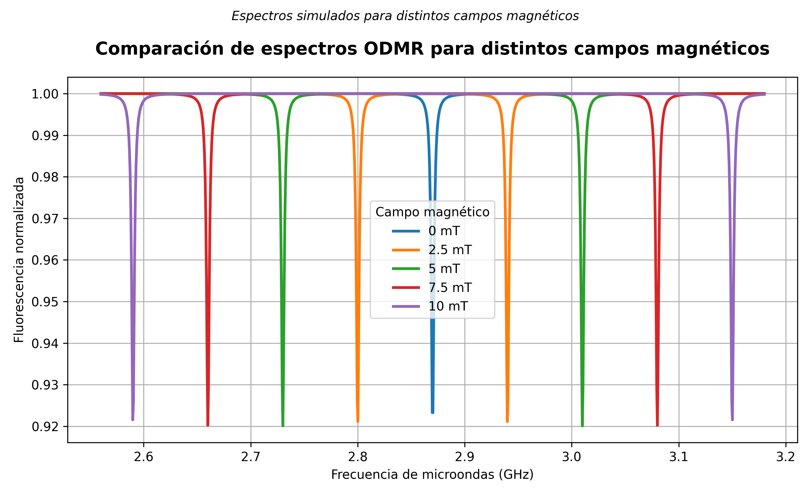

# 🔬 Quantum Sensing

Educational notes and Python simulations on nitrogen-vacancy (NV) centers in diamond.


---

## 📖 Study Manual

This repository includes a complete introductory manual on quantum sensing based on NV centers in diamond, written during my extracurricular internship at the Nanomaterials and Nanotechnology Research Center (CINN).

The manual provides a progressive introduction to:

- the fundamentals of quantum sensing;
- the structural, optical and electronic properties of diamond;
- NV charge states and spin structure;
- the effective ground-state spin Hamiltonian;
- magnetic, electric, strain and temperature effects;
- spin relaxation and coherence times;
- Optically Detected Magnetic Resonance (ODMR);
- pulsed ESR spectra;
- magnetic sensitivity, noise and signal-to-noise ratio;
- microwave-based spin control;
- radiofrequency signal generators and spectrum analyzers.

The document includes commented equations, original educational diagrams, figures adapted from scientific literature and a final table documenting the source and treatment of every figure.

The complete 75-page study manual is available in the `docs` folder:

- [📜 Quantum Sensing Study Manual (PDF)](docs/Quantum_Sensing_Study_Manual.pdf)

---

## Overview

This repository contains my study notes, technical documentation and educational material related to quantum sensing with nitrogen-vacancy (NV) centers in diamond.

The project was developed during my extracurricular internship at the Nanomaterials and Nanotechnology Research Center (CINN), where I studied the fundamentals of quantum sensing, NV-center physics, microwave instrumentation and ODMR (Optically Detected Magnetic Resonance).

Besides the theoretical material, the repository includes an interactive Python program that simulates ODMR spectra under different experimental conditions and reconstructs the external magnetic field from the resonance frequencies.

The simulator is currently being reviewed and extended to reflect the additional physical concepts included in the study manual.

---

## Repository Contents

- 📃 Literature review
- 📃 Study notes
- 📃 Technical summaries
- 📘 Complete quantum sensing study manual
- 📊 Figures and diagrams
- 🐍 Interactive ODMR simulator (Python)
- 📑 Automatically generated simulation reports

---

## 🐍 ODMR Simulator

The repository includes an interactive Python simulator that reproduces the ODMR spectrum of a single NV center in diamond under different experimental conditions.

The simulator allows the user to modify the main experimental parameters, visualize the resulting ODMR spectra and estimate the external magnetic field from the measured resonance frequencies.

---

### Features

- ✅ ODMR simulation without magnetic field
- ✅ ODMR simulation with an external magnetic field
- ✅ Zeeman splitting simulation
- ✅ Adjustable microwave power
- ✅ Adjustable photon detection rate
- ✅ Adjustable experimental noise
- ✅ Automatic resonance detection
- ✅ Magnetic field estimation
- ✅ Approximate magnetic sensitivity estimation
- ✅ Comparison of multiple magnetic fields
- ✅ Automatic PNG figure generation
- ✅ Automatic TXT report generation

---

## Example Outputs

### ODMR Spectrum without Magnetic Field


---

### ODMR Spectrum with an External Magnetic Field


---

### Comparison of Different Magnetic Fields



---

## 📈 Research Progress

Current status of the project:

- ✅ Literature review on quantum sensing
- ✅ Study of nitrogen-vacancy (NV) centers in diamond
- ✅ Study of the NV effective spin Hamiltonian
- ✅ ODMR theoretical foundations
- ✅ Study of coherence, relaxation and magnetic sensitivity
- ✅ Study of microwave-based spin control
- ✅ Educational notes and technical summaries
- ✅ Complete 75-page introductory study manual
- ✅ Python ODMR simulator (Version v1.1.0)
- ✅ Automatic report generation
- ✅ Figure generation for data visualization
- 🔄 Review and extension of the simulation code
- 🔄 Continuous improvement of documentation and educational material

---

## ✡️ Physics Implemented

The current version of the simulator includes the following physical concepts:

- Zero-field splitting (\(D = 2.87\ \text{GHz}\))
- Zeeman interaction under an external magnetic field
- Lorentzian ODMR resonance model
- Gaussian experimental noise
- Automatic resonance detection
- Magnetic field reconstruction from resonance frequencies
- Approximate magnetic sensitivity estimation

Additional concepts presented in the study manual will be incorporated during the next stage of code development.

---

## 💻 Requirements

The simulator was developed in Python and requires:

- Python 3.11 or later
- NumPy
- Matplotlib

---

## 📚 References

This project is based on scientific literature and technical documentation on quantum sensing and nitrogen-vacancy (NV) centers in diamond used during the internship at CINN.

Key references include:

- Barry, J. F. et al. (2020). *Sensitivity optimization for NV-diamond magnetometry*.
- Degen, C. L., Reinhard, F., & Cappellaro, P. (2017). *Quantum sensing*.
- Doherty, M. W. et al. (2013). *The nitrogen-vacancy colour centre in diamond*.
- Dréau, A. et al. (2011). *Avoiding power broadening in optically detected magnetic resonance of single NV defects for enhanced dc magnetic    field sensitivity*.
- Rondin, L. et al. (2014). *Magnetometry with nitrogen-vacancy defects in diamond*.

Additional scientific articles, textbooks, theses and technical documentation are listed in the accompanying study manual.

---

## ▶️ How to Run

Clone the repository:

```bash
git clone https://github.com/sofianunezda/Quantum-sensing.git
```

Install the required packages:

```bash
pip install numpy matplotlib
```

Run the simulator:

```bash
python odmr_simulation.py
```

---

## 🎯 Project Goals
The aim of this repository is to provide an accessible introduction to quantum sensing based on nitrogen-vacancy (NV) centers in diamond by combining theoretical background with interactive numerical simulations.

The project is intended for physics students, researchers beginning in the field and anyone interested in understanding the fundamental principles of NV-based quantum sensing.

The next stage of the project is to extend the simulator while preserving its current structure and educational approach, incorporating additional concepts developed in the study manual.

---

## 📄 License

This project is licensed under the MIT License. See the LICENSE⁠Attachment.png file for details.

If you use the manual, code or figures in academic or educational work, acknowledgment of this repository is appreciated.

---

## 👩‍🔬 Author

Sofía Núñez de Andrés

Physics Student
University of Oviedo

Extracurricular internship at the Nanomaterials and Nanotechnology Research Center (CINN)

GitHub:
https://github.com/sofianunezda

---
